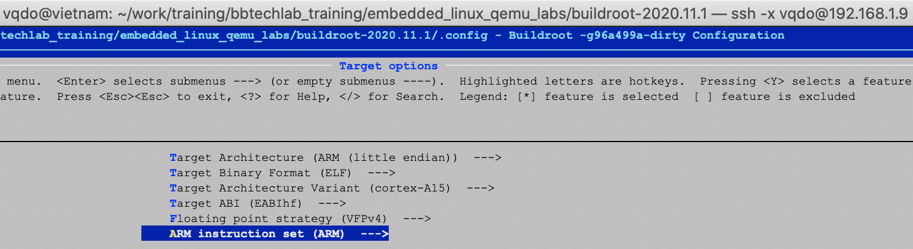
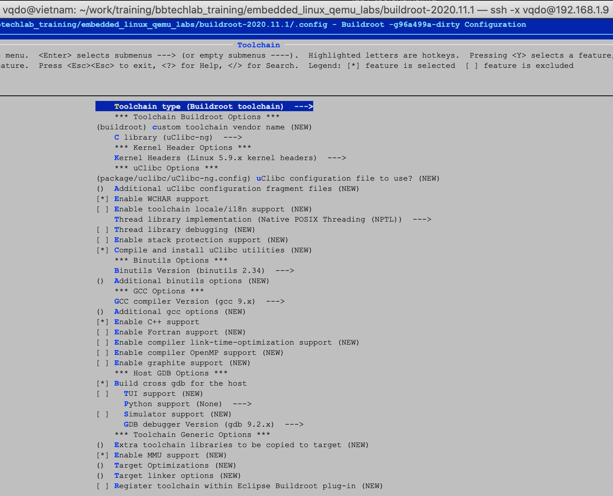

# Building a cross-compiling ARM toolchain

The compiler toolchains are part of the basic tool sets (compiler, linker, assembler, etc.) that produce machine code for a CPU instruction set (x86, ARM, etc.) from your programming code.

When working with embedded system, we need a cross compiler toolchain. it is used to compile your programs on your host machine's CPU such as x86 laptop/ or desktop computer for a target's CPU architecture. For example, if you have a cross toolchain for ARM, you will compile your programms on Laptop and then run it on target ARM device.    

* You can refer to [toolchains](https://elinux.org/Toolchains) in detail.
* There are severals to get a toolchains: pre-compiled toolchains (CodeSourcery, Bootlin, Liano)  or build your own toolchain by using [buildroot](https://buildroot.org/), [crosstool-ng](https://crosstool-ng.github.io/docs/introduction/), etc... 
    * [Crosstool-NG](https://crosstool-ng.github.io/docs/introduction/) is a tool that builds cross toolchains, it build the standard libraries.
    * [Buildroot](https://buildroot.org/), it is not only build a cross toolchains but also an complete root filesystem(kernel, bootloader, rootfs, etc.). Not like Crosstool-NG, it will include all the shared libraries are needed into the root filesystem.

With this lab, I describe steps by steps to build a toolchain using the toolchains buildsystem - [buildroot](https://buildroot.org/).

## Prerequisite

Host environment is required for this lab consists of
* Host machine is Ubuntu 14_O4_05LTS_x64
* $ sudo apt install qemu-user qemu-system-arm build-essential git autoconf bison flex texinfo help2man gawk libtool-bin libncurses5-dev

## Steps by steps to build a cross-compile toolchain for ARM 

We will build a cross-compile toolchain for ARM Versatile Express that is suppoerted by QEMU ARM emulator.
```
[12:02 AM]vqdo@vietnam:~$ qemu-system-arm -machine help
Supported machines are:
versatileab          ARM Versatile/AB (ARM926EJ-S)
versatilepb          ARM Versatile/PB (ARM926EJ-S)
lm3s811evb           Stellaris LM3S811EVB
z2                   Zipit Z2 (PXA27x)
connex               Gumstix Connex (PXA255)
sx1                  Siemens SX1 (OMAP310) V2
realview-eb          ARM RealView Emulation Baseboard (ARM926EJ-S)
cubieboard           cubietech cubieboard
vexpress-a9          ARM Versatile Express for Cortex-A9
lm3s6965evb          Stellaris LM3S6965EVB
realview-pbx-a9      ARM RealView Platform Baseboard Explore for Cortex-A9
musicpal             Marvell 88w8618 / MusicPal (ARM926EJ-S)
mainstone            Mainstone II (PXA27x)
terrier              Terrier PDA (PXA270)
n810                 Nokia N810 tablet aka. RX-44 (OMAP2420)
xilinx-zynq-a9       Xilinx Zynq Platform Baseboard for Cortex-A9
nuri                 Samsung NURI board (Exynos4210)
realview-eb-mpcore   ARM RealView Emulation Baseboard (ARM11MPCore)
verdex               Gumstix Verdex (PXA270)
spitz                Spitz PDA (PXA270)
canon-a1100          Canon PowerShot A1100 IS
akita                Akita PDA (PXA270)
smdkc210             Samsung SMDKC210 board (Exynos4210)
integratorcp         ARM Integrator/CP (ARM926EJ-S)
sx1-v1               Siemens SX1 (OMAP310) V1
kzm                  ARM KZM Emulation Baseboard (ARM1136)
highbank             Calxeda Highbank (ECX-1000)
n800                 Nokia N800 tablet aka. RX-34 (OMAP2420)
collie               Collie PDA (SA-1110)
realview-pb-a8       ARM RealView Platform Baseboard for Cortex-A8
vexpress-a15         ARM Versatile Express for Cortex-A15
none                 empty machine
cheetah              Palm Tungsten|E aka. Cheetah PDA (OMAP310)
tosa                 Tosa PDA (PXA255)
midway               Calxeda Midway (ECX-2000)
virt                 ARM Virtual Machine
borzoi               Borzoi PDA (PXA270)
```

### Download
We can download the build root from https://buildroot.org/download.html. At this time, I used the latest stable release: 2020.11.1. 
```
$ wget https://buildroot.org/downloads/buildroot-2020.11.1.tar.gz
$ tar -xvf buildroot-2020.11.1.tar.gz
$ cd buildroot-2020.11.1
$ make menuconfig
```
### Set the following configuration
[ARM Cortex-A15](https://en.wikipedia.org/wiki/ARM_Cortex-A15)
Target options
```
– Target Architecture: ARM (little endian)
– Target Architecture Variant: cortex-A15
– Target ABI (EABIhf)
– Floating point strategy (VFPv4)
```

Toolchain
```
- Toolchain type: Buildroot toolchain
– Kernel Header: Linux 5.9.x
– Compile and install uClibc
– Enable WCHAR support
– GCC compiler version (gcc 9.x)
– Enable C++ support
– Enable GDB.
```


### Compile
```
$ make
$ ls -al output/host/
total 36
drwxr-xr-x  9 vqdo vqdo 4096 Jan  9 00:39 .
drwxrwxr-x  6 vqdo vqdo 4096 Jan  9 01:03 ..
drwxr-xr-x  6 vqdo vqdo 4096 Jan  9 00:55 arm-buildroot-linux-uclibcgnueabihf
drwxr-xr-x  2 vqdo vqdo 4096 Jan  9 01:03 bin
drwxr-xr-x  3 vqdo vqdo 4096 Jan  9 01:03 etc
drwxr-xr-x 10 vqdo vqdo 4096 Jan  9 01:03 include
drwxr-xr-x  4 vqdo vqdo 4096 Jan  9 00:58 lib
lrwxrwxrwx  1 vqdo vqdo    3 Jan  9 00:24 lib64 -> lib
drwxr-xr-x  3 vqdo vqdo 4096 Jan  9 00:39 libexec
drwxr-xr-x 14 vqdo vqdo 4096 Jan  9 01:03 share
lrwxrwxrwx  1 vqdo vqdo    1 Jan  9 00:24 usr -> .
```
## Testing the cross toolchains
Export path environment toolchains. Adding below line to $(HOME)/.bashrc
```
$ sudo mkdir -p /opt/toolchains/arm-buildroot-linux-uclibcgnueabihf
$ cd buildroot-2020.11.1
$ sudo rsync -ar output/host/* /opt/toolchains/arm-buildroot-linux-uclibcgnueabihf/
$ vi ~/.bashrc
export PATH=/opt/toolchains/arm-buildroot-linux-uclibcgnueabihf/bin/:$PATH
$ source ~/.bashrc
$ arm-buildroot-linux-uclibcgnueabihf-gcc --version
arm-buildroot-linux-uclibcgnueabihf-gcc.br_real (Buildroot -g96a499a-dirty) 9.3.0
Copyright (C) 2019 Free Software Foundation, Inc.
This is free software; see the source for copying conditions.  There is NO
warranty; not even for MERCHANTABILITY or FITNESS FOR A PARTICULAR PURPOSE.
```
Write a hello.c
```
#include <stdio>

int main()
{
    printf("Hello World - VQDO!\n");

    return 0;
}
```
Cross compile hello.c for ARM by using ARM cross toolchain
```
$ arm-buildroot-linux-uclibcgnueabihf-gcc -o hello hello.c
```
Run hello with qemu
```
$ qemu-arm hello
/lib/ld-uClibc.so.0: No such file or directory
$ find /opt/toolchains/arm-buildroot-linux-uclibcgnueabihf/ -name "*ld-uClibc.so*"
/opt/toolchains/arm-buildroot-linux-uclibcgnueabihf/arm-buildroot-linux-uclibcgnueabihf/sysroot/lib/ld-uClibc.so.0
/opt/toolchains/arm-buildroot-linux-uclibcgnueabihf/arm-buildroot-linux-uclibcgnueabihf/sysroot/lib/ld-uClibc.so.1
$ export LD_LIBRARY_PATH=/opt/toolchains/arm-buildroot-linux-uclibcgnueabihf/arm-buildroot-linux-uclibcgnueabihf/sysroot/lib/
$ qemu-arm hello
Hello World - VQDO!
```
if we build hello with static libs, we dont need to export LD_LIBRARY_PATH to tell qemu where is ld-uClibc.so.0
```
$ unset LD_LIBRARY_PATH
$ arm-buildroot-linux-uclibcgnueabihf-gcc -static -o hello_static hello.c
$ qemu-arm hello_static 
Hello World - VQDO!
```

## References
* https://elinux.org/Toolchains
* [bootlin qemu labs](https://bootlin.com/doc/training/embedded-linux-qemu/embedded-linux-qemu-labs.pdf)