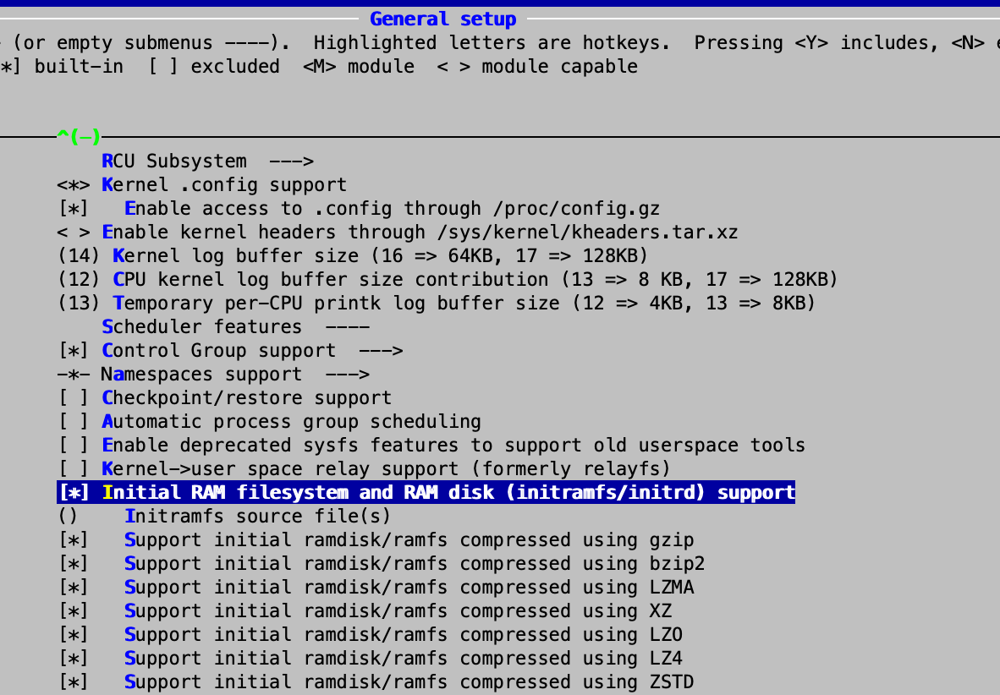
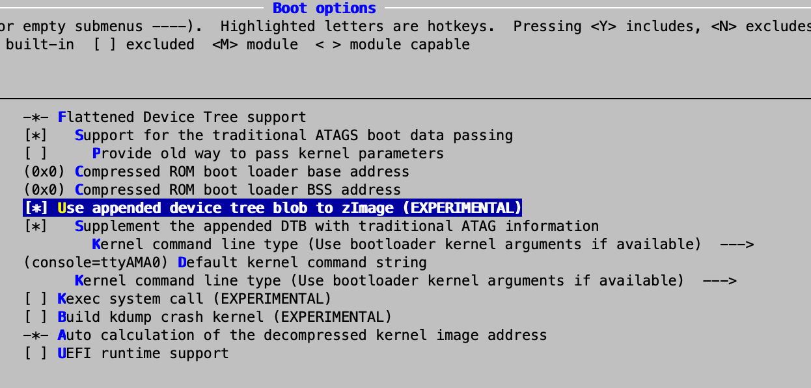
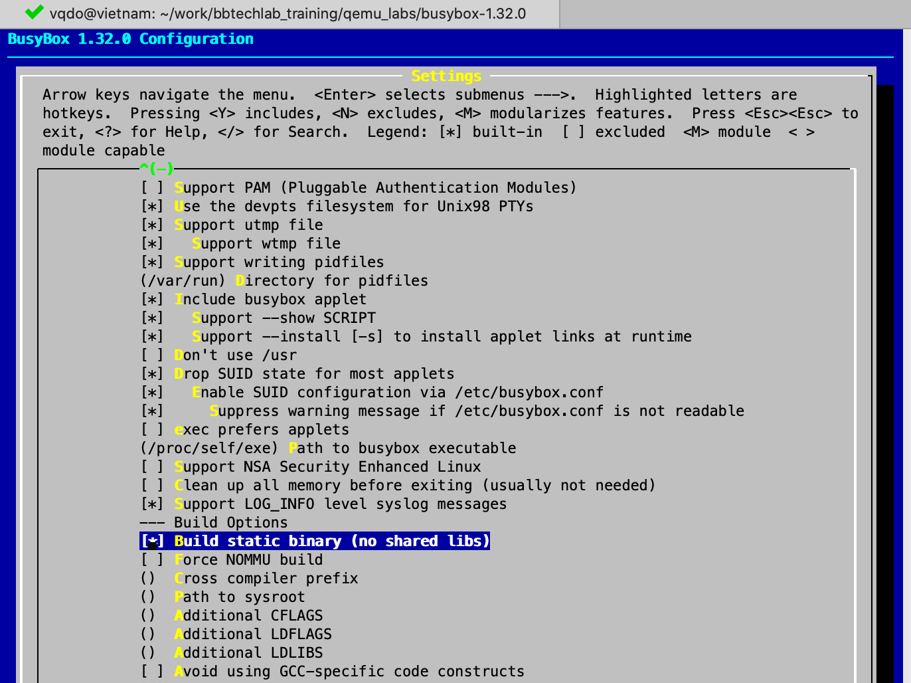

# Cross Compiling Linux kernel for QEMU ARM emulator
We need to complete [lab1_toolchains](lab1_toolchains.md) to generate the ARM cross toolchain which uses for compling kernel in this lab.

For this lab, we will decrible steps by steps for cross compiling kernel for ARM Versatile Express Cortex-A9 that is supported by QEMU ARM Emulator.
* Kernel header 5.5.x
* Target device: vexpress-a9 (ARM Versatile Express for Cortex-A9)

## Prerequisite

Host environment is required for this lab consists of
* Ubuntu 16_O4LTS_x64, for mines:
```
$ cat /proc/version
Linux version 4.15.0-136-generic (buildd@lcy01-amd64-014) (gcc version 5.4.0 20160609 (Ubuntu 5.4.0-6ubuntu1~16.04.12)) #140~16.04.1-Ubuntu SMP Wed Feb 3 18:51:03 UTC 2021
```
* $ sudo apt install qemu-user qemu-system-arm build-essential git autoconf bison flex texinfo help2man gawk libtool-bin libncurses5-dev

## Cross compiling kernel for ARM
Install ARM Cross toolchain
We're going to use the croos toolchain from [lab1_toolchains_crosstool-ng](https://github.com/bbtechlab/training.github.io/blob/embedded_linux/qemu_labs/lab1_toolchains_crosstool-ng.md)
* We can download it here, [arm-training-linux-uclibcgnueabi](https://github.com/bbtechlab/training.github.io/tree/embedded_linux/qemu_labs/lab1_toolchains)
```
$ export PATH=/opt/toolchains/arm-training-linux-uclibcgnueabi/bin/:$PATH
$ export LD_LIBRARY_PATH=$LD_LIBRARY_PATH:/opt/toolchains/arm-training-linux-uclibcgnueabi/arm-training-linux-uclibcgnueabi/sysroot:/opt/toolchains/arm-training-linux-uclibcgnueabi/lib/
```

Download kernel source from kernel.org
```
$ wget https://cdn.kernel.org/pub/linux/kernel/v5.x/linux-5.5.5.tar.xz
$ tar -xvf linux-5.5.5.tar.xz
```
Make kernel configuration for ARM Versatile Express Cortex-A9
```
$ cd linux-5.5.5
$ make ARCH=arm vexpress_defconfig
$ make ARCH=arm CROSS_COMPILE=arm-training-linux-uclibcgnueabi- menuconfig
```




Compiling
```
$ make ARCH=arm CROSS_COMPILE=arm-training-linux-uclibcgnueabi- all
...
  AS      arch/arm/boot/compressed/bswapsdi2.o
  LD      arch/arm/boot/compressed/vmlinux
  OBJCOPY arch/arm/boot/zImage
  Kernel: arch/arm/boot/zImage is ready
  DTC     arch/arm/boot/dts/vexpress-v2p-ca9.dtb
  MODPOST Module.symvers
```
Finally we have the ouput of kernel image locates in: arch/arm/boot/zImage and device tree binary in : arch/arm/boot/dts/vexpress-v2p-ca9.dtb

Now, we try to verify kernel zImage using QEMU ARM emulator by using command as below
```
$ cd linux-5.5.5
$ qemu-system-arm -M vexpress-a9 -m 512M -dtb arch/arm/boot/dts/vexpress-v2p-ca9.dtb -kernel arch/arm/boot/zImage -nographic
```
We got the result like below, however it is stopping because there is not root filesystem "Kernel panic - not syncing: VFS: Unable to mount root fs on unknown-block(0,0)" 
```
.....
enirq: Setting trigger mode 4 for irq 41 failed (gic_set_type+0x0/0x94)
drm-clcd-pl111 1c1f0000.clcd: pl111_amba_probe failed irq -22
drm-clcd-pl111: probe of 1c1f0000.clcd failed with error -22
ALSA device list:
  #0: ARM AC'97 Interface PL041 rev0 at 0x1c040000, irq 29
genirq: Setting trigger mode 4 for irq 34 failed (gic_set_type+0x0/0x94)
VFS: Cannot open root device "(null)" or unknown-block(0,0): error -6
Please append a correct "root=" boot option; here are the available partitions:
1f00           32768 mtdblock0 
 (driver?)
Kernel panic - not syncing: VFS: Unable to mount root fs on unknown-block(0,0)
CPU: 0 PID: 1 Comm: swapper/0 Tainted: G        W         5.9.16 #1
Hardware name: ARM-Versatile Express
[<8010ebc0>] (unwind_backtrace) from [<8010a834>] (show_stack+0x10/0x14)
[<8010a834>] (show_stack) from [<807815ec>] (dump_stack+0x98/0xac)
[<807815ec>] (dump_stack) from [<8077dc64>] (panic+0xf8/0x2f8)
[<8077dc64>] (panic) from [<80a01518>] (mount_block_root+0x1d0/0x248)
[<80a01518>] (mount_block_root) from [<80a0168c>] (mount_root+0xfc/0x104)
[<80a0168c>] (mount_root) from [<80a017e8>] (prepare_namespace+0x154/0x190)
[<80a017e8>] (prepare_namespace) from [<8078557c>] (kernel_init+0x8/0x118)
[<8078557c>] (kernel_init) from [<80100148>] (ret_from_fork+0x14/0x2c)
Exception stack(0x86893fb0 to 0x86893ff8)
3fa0:                                     00000000 00000000 00000000 00000000
3fc0: 00000000 00000000 00000000 00000000 00000000 00000000 00000000 00000000
3fe0: 00000000 00000000 00000000 00000000 00000013 00000000
---[ end Kernel panic - not syncing: VFS: Unable to mount root fs on unknown-block(0,0) ]---
```
## Cross Compiling mini rootfs using BusyBox for ARM
We already cross compiled the Kernel, now we continue to build a mini rootfs for this lab. Please following the steps are below:

Step 1: Download & compile
```
$ wget https://busybox.net/downloads/busybox-1.32.0.tar.bz2
$ tar xjvf busybox-1.32.0.tar.bz2
$ cd busybox-1.32.0
$ export ARCH=arm
$ export CROSS_COMPILE=arm-training-linux-uclibcgnueabi-
$ make defconfig && make menuconfig
```
The option to compile Busybox as a static executable, so that we don’t have to copy the dynamic libraries inside the root filesystem. The setting can be found in “Busybox Settings --> Build Options“. Also, select what utilities you want embedded in Busybox.

```
$ make install
.....
  ./_install//usr/sbin/ubirsvol -> ../../bin/busybox
  ./_install//usr/sbin/ubiupdatevol -> ../../bin/busybox
  ./_install//usr/sbin/udhcpd -> ../../bin/busybox
--------------------------------------------------
You will probably need to make your busybox binary
setuid root to ensure all configured applets will
work properly.
--------------------------------------------------
[11:12 PM]vqdo@vietnam:~/work/bbtechlab_training/qemu_labs/busybox-1.32.0$ 
```
When the cross compile finish, the output of folder "_install" is created and it contains a hierachy  of files & directories are known rootfs. It actually are busybox utilies binaries.   
```
[11:12 PM]vqdo@vietnam:~/work/bbtechlab_training/qemu_labs/busybox-1.32.0$ ls -al _install/
total 20
drwxrwxr-x  5 vqdo vqdo 4096 Th01 10 23:12 .
drwxr-xr-x 36 vqdo vqdo 4096 Th01 10 23:12 ..
drwxrwxr-x  2 vqdo vqdo 4096 Th01 10 23:12 bin
lrwxrwxrwx  1 vqdo vqdo   11 Th01 10 23:12 linuxrc -> bin/busybox
drwxrwxr-x  2 vqdo vqdo 4096 Th01 10 23:12 sbin
drwxrwxr-x  4 vqdo vqdo 4096 Th01 10 23:12 usr
```
However, "_install" is generated by busybox is not enough, we need manually to create more specifical files are at least required by Kernel. Example, let's see [linux/main.c](https://github.com/torvalds/linux/blob/master/init/main.c)
```
	if (!try_to_run_init_process("/sbin/init") ||
	    !try_to_run_init_process("/etc/init") ||
	    !try_to_run_init_process("/bin/init") ||
	    !try_to_run_init_process("/bin/sh"))
		return 0;
```
Kernel init process will try to start /sbin/init or /etc/init .... firstly.
```
	$ cd _install
	$ mkdir -p {bin,dev,sbin,etc/init.d,proc,sys/kernel/debug,usr/{bin,sbin},lib,lib64,mnt/root,root}
	$ vim ./etc/init.d/rcS
	mount -t proc none /proc
	mount -t sysfs none /sys
	mount -t debugfs none /sys/kernel/debug
	exec /bin/sh
	$ chmod a+x ./etc/init.d/rcS
```
We copied hello_static application from [lab1_toolchains](lab1_toolchains.md) into _install as well.
```
$ cp hello_static _install/root/
```

Finally, we compress "_install" folder to rootfs formated initramfs by using cpio tool.
```
$ [11:51 PM]vqdo@vietnam:~/work/bbtechlab_training/qemu_labs/busybox-1.32.0/_install$ ls -al
total 52
drwxrwxr-x 13 vqdo vqdo 4096 Th01 10 23:32 .
drwxr-xr-x 36 vqdo vqdo 4096 Th01 10 23:12 ..
drwxrwxr-x  2 vqdo vqdo 4096 Th01 10 23:12 bin
drwxrwxr-x  2 vqdo vqdo 4096 Th01 10 23:32 dev
drwxrwxr-x  3 vqdo vqdo 4096 Th01 10 23:32 etc
drwxrwxr-x  2 vqdo vqdo 4096 Th01 10 23:32 lib
drwxrwxr-x  2 vqdo vqdo 4096 Th01 10 23:32 lib64
lrwxrwxrwx  1 vqdo vqdo   11 Th01 10 23:12 linuxrc -> bin/busybox
drwxrwxr-x  3 vqdo vqdo 4096 Th01 10 23:32 mnt
drwxrwxr-x  2 vqdo vqdo 4096 Th01 10 23:32 proc
drwxrwxr-x  2 vqdo vqdo 4096 Th01 10 23:51 root
drwxrwxr-x  2 vqdo vqdo 4096 Th01 10 23:12 sbin
drwxrwxr-x  3 vqdo vqdo 4096 Th01 10 23:32 sys
drwxrwxr-x  4 vqdo vqdo 4096 Th01 10 23:12 usr
$ find . | cpio -o --format=newc > ../rootfs.img
```
## Loading Linux with BusyBox on ARM QEMU
Create lab2_kernel_run_qemu_arm.sh
```
#!/bin/sh

DTB_TARGET=$1
KER_TARGET=$2
ROO_TARGET=$3

if [ "$#" -ne 3 ]; then
    echo "Usage: lab2_kernel_run_qemu_arm.sh [dtb] [kernel] [rootfs]"
    exit 1
fi

qemu-system-arm -M vexpress-a9 -m 512M \
    -dtb ${DTB_TARGET} \
    -kernel ${KER_TARGET} \
    -initrd ${ROO_TARGET} -nographic \
    -append "root=/dev/ram rdinit=/sbin/init earlyprintk=serial,ttyS0 console=ttyAMA0"
``` 
Run command to load zImage & rootfs on ARM QEMU
```
[12:06 AM]vqdo@vietnam:~/work/bbtechlab_training/qemu_labs$ ./lab2_kernel_run_qemu_arm.sh linux-5.9.16/arch/arm/boot/dts/vexpress-v2p-ca15_a7.dtb linux-5.9.16/arch/arm/boot/zImage busybox-1.32.0/rootfs.img
...
Booting Linux on physical CPU 0x0
Linux version 5.5.5 (bamboo@bbtechlab) (gcc version 9.2.0 (crosstool-NG 1.24.0.105_5659366)) #1 SMP Thu Mar 4 12:33:18 +07 2021
CPU: ARMv7 Processor [410fc090] revision 0 (ARMv7), cr=10c5387d
CPU: PIPT / VIPT nonaliasing data cache, VIPT nonaliasing instruction cache
OF: fdt: Machine model: V2P-CA9
..............
drm-clcd-pl111 10020000.clcd: initializing Versatile Express PL111
drm-clcd-pl111 10020000.clcd: DVI muxed to daughterboard 1 (core tile) CLCD

/ # cat /proc/version 
Linux version 5.5.5 (bamboo@bbtechlab) (gcc version 9.2.0 (crosstool-NG 1.24.0.105_5659366)) #1 SMP Thu Mar 4 12:33:18 +07 2021
/ # uname -a
Linux (none) 5.5.5 #1 SMP Thu Mar 4 12:33:18 +07 2021 armv7l GNU/Linux
/ # 
```
## Implement Makefile for all steps are mentioned above
```
$ mkdir -p opensource
$ mkdir -p lab2_kernel
$ cd lab2_kernel
$ vi Makefile
# ----------------------------------------------------------------------------
# Filename     : Makefile
#
# Description  :
#
# Version      : 1.0
# 
# Created      : 30/12/2020 10:54:42 PM
# Revision     : none
# Compiler     : GNU Make
# Author       : Bamboo Do (vqdo), dovanquyen.vn@gmail.com
# Copyright (c) 2020,  All rights reserved.
# ----------------------------------------------------------------------------

TOP := $(shell pwd)

# ----------------------------------------------------------------------------
# Compiler settings
CROSS_COMPILE ?= arm-training-linux-uclibcgnueabi-
CROSS_BUSYBOX ?= arm-training-linux-uclibcgnueabi-
ARCH ?= arm
TARGET_BOARD ?= vexpress
OPENSOURCE ?= $(TOP)/../opensource
LINUX ?= linux-5.5.5
BUSYBOX ?= busybox-1.32.0
OUT=$(TOP)/$(TARGET_BOARD)
CC ?= $(CROSS_COMPILE)gcc
AR ?= $(CROSS_COMPILE)ar

# ----------------------------------------------------------------------------
# Build objects
obj-y :=
obj-y += build_date.o

# ----------------------------------------------------------------------------
# Include header
#INC :=
#CFLAGS := -fdata-sections -ffunction-sections -std=gnu99 -fno-strict-aliasing -fPIC \
            -DLINUX -pipe -D_FILE_OFFSET_BITS=64 -D_GNU_SOURCE=1 -D__LINUX__

CFLAGS += -Wno-error=date-time

# ----------------------------------------------------------------------------
# Libraries objects

#LIBLIST := -lpthread 
#LDFLAGS := -Wl,--gc-sections

# ----------------------------------------------------------------------------
# Rules

all: BUILD_DATE kernel rootfs

BUILD_DATE: FORCE
	@echo "const char *g_strAppBuildDate = \"`date`\";" > build_date.c
	@echo "const char *g_strAppBuildUser = \"`whoami`@`hostname`\";" >> build_date.c

kernel_config:
	@echo Compiling kernel ...........................
	@mkdir -p $(OUT)/obj/kernel
	@cp $(OPENSOURCE)/$(LINUX)/arch/$(ARCH)/configs/$(TARGET_BOARD)_defconfig $(OUT)/obj/kernel/.config  
	@cd $(OPENSOURCE)/$(LINUX) && make ARCH=$(ARCH) CROSS_COMPILE=$(CROSS_COMPILE) O=$(OUT)/obj/kernel olddefconfig

kernel: kernel_config
	@echo Compiling ... $<
	@cd $(OPENSOURCE)/$(LINUX) && make ARCH=$(ARCH) CROSS_COMPILE=$(CROSS_COMPILE) O=$(OUT)/obj/kernel nconfig 
	@cd $(OPENSOURCE)/$(LINUX) && make ARCH=$(ARCH) CROSS_COMPILE=$(CROSS_COMPILE) CFLAGS=$(CFLAGS) O=$(OUT)/obj/kernel -j2
	@cp -f $(OUT)/obj/kernel/arch/arm/boot/dts/vexpress-v2p-ca9.dtb $(OUT)/
	@cp -f $(OUT)/obj/kernel/arch/arm/boot/zImage $(OUT)/

busybox:
	@mkdir -p $(OUT)/obj/busybox
	@cd $(OPENSOURCE)/$(BUSYBOX) && make O=$(OUT)/obj/busybox ARCH=$(ARCH) CROSS_COMPILE=$(CROSS_BUSYBOX) defconfig
	@cd $(OPENSOURCE)/$(BUSYBOX) && make O=$(OUT)/obj/busybox ARCH=$(ARCH) CROSS_COMPILE=$(CROSS_BUSYBOX) menuconfig
	@cd $(OUT)/obj/busybox && make ARCH=$(ARCH) CROSS_COMPILE=$(CROSS_BUSYBOX) install

rootfs:
	@echo Compiling rootfs ...........................
	@mkdir -p $(OUT)/rootfs
	@mkdir -p $(addprefix $(OUT)/rootfs/,'bin' 'dev' 'sbin' 'etc' 'proc' 'usr' 'lib' 'lib64' 'mnt' 'root')
	@mkdir -p $(addprefix $(OUT)/rootfs/,'etc/init.d' 'proc' 'sys/kernel/debug' 'usr/bin' 'usr/sbin')
	@rsync -ar $(OUT)/obj/busybox/_install/* $(OUT)/rootfs/	
	@cd $(OUT)/rootfs && echo "#!/bin/sh" > ./etc/init.d/rcS
	@cd $(OUT)/rootfs && echo "mount -t proc none /proc" >> ./etc/init.d/rcS
	@cd $(OUT)/rootfs && echo "mount -t sysfs none /sys" >> ./etc/init.d/rcS
	@cd $(OUT)/rootfs && echo "exec /bin/sh" >> ./etc/init.d/rcS
	@cd $(OUT)/rootfs && chmod a+x ./etc/init.d/rcS
	@cd $(OUT)/rootfs && find . | cpio -H newc -o > $(OUT)/rootfs.cpio
	@cd $(OUT) && cat rootfs.cpio | gzip > $(OUT)/rootfs.igz && rm -f $(OUT)/rootfs.cpio

busybox_clean:
	@cd $(OPENSOURCE)/$(BUSYBOX) && make O=$(OUT)/obj/busybox ARCH=$(ARCH) CROSS_COMPILE=$(CROSS_BUSYBOX) clean
	@cd $(OPENSOURCE)/$(BUSYBOX) && make O=$(OUT)/obj/busybox ARCH=$(ARCH) CROSS_COMPILE=$(CROSS_BUSYBOX) mrproper
	@cd $(OPENSOURCE)/$(BUSYBOX) && make O=$(OUT)/obj/busybox ARCH=$(ARCH) CROSS_COMPILE=$(CROSS_BUSYBOX) distclean
	@rm -rf $(OUT)/obj/busybox

kernel_clean:
	@cd $(OPENSOURCE)/$(LINUX) && make ARCH=$(ARCH) CROSS_COMPILE=$(CROSS_COMPILE) clean
	@cd $(OPENSOURCE)/$(LINUX) && make ARCH=$(ARCH) CROSS_COMPILE=$(CROSS_COMPILE) mrproper
	@cd $(OPENSOURCE)/$(LINUX) && make ARCH=$(ARCH) CROSS_COMPILE=$(CROSS_COMPILE) distclean
	@rm -rf $(OUT)/obj/kernel

clean: kernel_clean busybox_clean
	@rm -rf $(OUT)
	
distclean: clean	

FORCE:
```
Steps to compile
```
$ cd opensource
$ wget https://cdn.kernel.org/pub/linux/kernel/v5.x/linux-5.5.5.tar.xz
$ tar -xvf linux-5.5.5.tar.xz
$ wget https://busybox.net/downloads/busybox-1.32.0.tar.bz2
$ tar xjvf busybox-1.32.0.tar.bz2
$ make kernel
$ make busybox
$ make rootfs
[02:12 PM]bamboo@bbtechlab:~/workspace/training/bbtechlab_training/qemu_labs/lab2_kernel$ tree -L 3 ./
./
├── lab2_kernel_run_qemu_arm.sh
├── Makefile
└── vexpress
    ├── obj
    │   ├── busybox
    │   └── kernel
    ├── rootfs
    │   ├── bin
    │   ├── dev
    │   ├── etc
    │   ├── lib
    │   ├── lib64
    │   ├── linuxrc -> bin/busybox
    │   ├── mnt
    │   ├── proc
    │   ├── root
    │   ├── sbin
    │   ├── sys
    │   └── usr
    ├── rootfs.igz
    ├── vexpress-v2p-ca9.dtb
    └── zImage
```
Verify the output
```
[02:12 PM]bamboo@bbtechlab:~/workspace/training/bbtechlab_training/qemu_labs/lab2_kernel$ ./lab2_kernel_run_qemu_arm.sh vexpress/vexpress-v2p-ca9.dtb vexpress/zImage vexpress/rootfs.igz
....
Booting Linux on physical CPU 0x0
Linux version 5.5.5 (bamboo@bbtechlab) (gcc version 9.2.0 (crosstool-NG 1.24.0.105_5659366)) #1 SMP Thu Mar 4 12:33:18 +07 2021
CPU: ARMv7 Processor [410fc090] revision 0 (ARMv7), cr=10c5387d
CPU: PIPT / VIPT nonaliasing data cache, VIPT nonaliasing instruction cache
OF: fdt: Machine model: V2P-CA9
Memory policy: Data cache writeback
Reserved memory: created DMA memory pool at 0x4c000000, size 8 MiB
OF: reserved mem: initialized node vram@4c000000, compatible id shared-dma-pool
cma: Reserved 16 MiB at 0x7f000000
CPU: All CPU(s) started in SVC mode.
percpu: Embedded 19 pages/cpu s45644 r8192 d23988 u77824
Built 1 zonelists, mobility grouping on.  Total pages: 130048
Kernel command line: root=/dev/ram rdinit=/sbin/init earlyprintk=serial,ttyS0 console=ttyAMA0
printk: log_buf_len individual max cpu contribution: 4096 bytes
printk: log_buf_len total cpu_extra contributions: 12288 bytes
printk: log_buf_len min size: 16384 bytes
printk: log_buf_len: 32768 bytes
printk: early log buf free: 14816(90%)
Dentry cache hash table entries: 65536 (order: 6, 262144 bytes, linear)
Inode-cache hash table entries: 32768 (order: 5, 131072 bytes, linear)
mem auto-init: stack:off, heap alloc:off, heap free:off
Memory: 491380K/524288K available (7168K kernel code, 429K rwdata, 1708K rodata, 1024K init, 155K bss, 16524K reserved, 16384K cma-reserved)
SLUB: HWalign=64, Order=0-3, MinObjects=0, CPUs=4, Nodes=1
rcu: Hierarchical RCU implementation.
rcu: 	RCU event tracing is enabled.
rcu: 	RCU restricting CPUs from NR_CPUS=8 to nr_cpu_ids=4.
rcu: RCU calculated value of scheduler-enlistment delay is 10 jiffies.
rcu: Adjusting geometry for rcu_fanout_leaf=16, nr_cpu_ids=4
NR_IRQS: 16, nr_irqs: 16, preallocated irqs: 16
GIC CPU mask not found - kernel will fail to boot.
GIC CPU mask not found - kernel will fail to boot.
L2C: platform modifies aux control register: 0x02020000 -> 0x02420000
L2C: DT/platform modifies aux control register: 0x02020000 -> 0x02420000
L2C-310 enabling early BRESP for Cortex-A9
L2C-310 full line of zeros enabled for Cortex-A9
L2C-310 dynamic clock gating disabled, standby mode disabled
L2C-310 cache controller enabled, 8 ways, 128 kB
L2C-310: CACHE_ID 0x410000c8, AUX_CTRL 0x46420001
random: get_random_bytes called from start_kernel+0x310/0x4c0 with crng_init=0
sched_clock: 32 bits at 24MHz, resolution 41ns, wraps every 89478484971ns
clocksource: arm,sp804: mask: 0xffffffff max_cycles: 0xffffffff, max_idle_ns: 1911260446275 ns
Failed to initialize '/smb@4000000/motherboard/iofpga@7,00000000/timer@12000': -22
smp_twd: clock not found -2
Console: colour dummy device 80x30
Calibrating local timer... 103.59MHz.
Calibrating delay loop... 881.45 BogoMIPS (lpj=4407296)
pid_max: default: 32768 minimum: 301
Mount-cache hash table entries: 1024 (order: 0, 4096 bytes, linear)
Mountpoint-cache hash table entries: 1024 (order: 0, 4096 bytes, linear)
CPU: Testing write buffer coherency: ok
CPU0: Spectre v2: using BPIALL workaround
CPU0: thread -1, cpu 0, socket 0, mpidr 80000000
Setting up static identity map for 0x60100000 - 0x60100060
rcu: Hierarchical SRCU implementation.
smp: Bringing up secondary CPUs ...
smp: Brought up 1 node, 1 CPU
SMP: Total of 1 processors activated (881.45 BogoMIPS).
CPU: All CPU(s) started in SVC mode.
devtmpfs: initialized
VFP support v0.3: implementor 41 architecture 3 part 30 variant 9 rev 0
clocksource: jiffies: mask: 0xffffffff max_cycles: 0xffffffff, max_idle_ns: 19112604462750000 ns
futex hash table entries: 1024 (order: 4, 65536 bytes, linear)
NET: Registered protocol family 16
DMA: preallocated 256 KiB pool for atomic coherent allocations
cpuidle: using governor ladder
hw-breakpoint: debug architecture 0x4 unsupported.
Serial: AMBA PL011 UART driver
10009000.uart: ttyAMA0 at MMIO 0x10009000 (irq = 29, base_baud = 0) is a PL011 rev1
printk: console [ttyAMA0] enabled
1000a000.uart: ttyAMA1 at MMIO 0x1000a000 (irq = 30, base_baud = 0) is a PL011 rev1
1000b000.uart: ttyAMA2 at MMIO 0x1000b000 (irq = 31, base_baud = 0) is a PL011 rev1
1000c000.uart: ttyAMA3 at MMIO 0x1000c000 (irq = 32, base_baud = 0) is a PL011 rev1
OF: amba_device_add() failed (-19) for /smb@4000000/motherboard/iofpga@7,00000000/wdt@f000
OF: amba_device_add() failed (-19) for /memory-controller@100e0000
OF: amba_device_add() failed (-19) for /memory-controller@100e1000
OF: amba_device_add() failed (-19) for /watchdog@100e5000
irq: type mismatch, failed to map hwirq-75 for interrupt-controller@1e001000!
SCSI subsystem initialized
usbcore: registered new interface driver usbfs
usbcore: registered new interface driver hub
usbcore: registered new device driver usb
Advanced Linux Sound Architecture Driver Initialized.
clocksource: Switched to clocksource arm,sp804
NET: Registered protocol family 2
tcp_listen_portaddr_hash hash table entries: 512 (order: 0, 6144 bytes, linear)
TCP established hash table entries: 4096 (order: 2, 16384 bytes, linear)
TCP bind hash table entries: 4096 (order: 3, 32768 bytes, linear)
TCP: Hash tables configured (established 4096 bind 4096)
UDP hash table entries: 256 (order: 1, 8192 bytes, linear)
UDP-Lite hash table entries: 256 (order: 1, 8192 bytes, linear)
NET: Registered protocol family 1
RPC: Registered named UNIX socket transport module.
RPC: Registered udp transport module.
RPC: Registered tcp transport module.
RPC: Registered tcp NFSv4.1 backchannel transport module.
Unpacking initramfs...
Freeing initrd memory: 724K
hw perfevents: enabled with armv7_cortex_a9 PMU driver, 1 counters available
workingset: timestamp_bits=30 max_order=17 bucket_order=0
squashfs: version 4.0 (2009/01/31) Phillip Lougher
jffs2: version 2.2. (NAND) © 2001-2006 Red Hat, Inc.
9p: Installing v9fs 9p2000 file system support
io scheduler mq-deadline registered
io scheduler kyber registered
drm-clcd-pl111 1001f000.clcd: assigned reserved memory node vram@4c000000
drm-clcd-pl111 1001f000.clcd: using device-specific reserved memory
drm-clcd-pl111 1001f000.clcd: initializing Versatile Express PL111
drm-clcd-pl111 1001f000.clcd: core tile graphics present
drm-clcd-pl111 1001f000.clcd: this device will be deactivated
Error: Driver 'vexpress-muxfpga' is already registered, aborting...
drm-clcd-pl111 10020000.clcd: initializing Versatile Express PL111
drm-clcd-pl111 10020000.clcd: DVI muxed to daughterboard 1 (core tile) CLCD
physmap-flash 40000000.flash: physmap platform flash device: [mem 0x40000000-0x43ffffff]
40000000.flash: Found 2 x16 devices at 0x0 in 32-bit bank. Manufacturer ID 0x000000 Chip ID 0x000000
Intel/Sharp Extended Query Table at 0x0031
Using buffer write method
physmap-flash 40000000.flash: physmap platform flash device: [mem 0x44000000-0x47ffffff]
40000000.flash: Found 2 x16 devices at 0x0 in 32-bit bank. Manufacturer ID 0x000000 Chip ID 0x000000
Intel/Sharp Extended Query Table at 0x0031
Using buffer write method
Concatenating MTD devices:
(0): "40000000.flash"
(1): "40000000.flash"
into device "40000000.flash"
physmap-flash 48000000.psram: physmap platform flash device: [mem 0x48000000-0x49ffffff]
libphy: Fixed MDIO Bus: probed
libphy: smsc911x-mdio: probed
smsc911x 4e000000.ethernet eth0: MAC Address: 52:54:00:12:34:56
isp1760 4f000000.usb: bus width: 32, oc: digital
isp1760 4f000000.usb: NXP ISP1760 USB Host Controller
isp1760 4f000000.usb: new USB bus registered, assigned bus number 1
isp1760 4f000000.usb: Scratch test failed.
isp1760 4f000000.usb: can't setup: -19
isp1760 4f000000.usb: USB bus 1 deregistered
usbcore: registered new interface driver usb-storage
rtc-pl031 10017000.rtc: registered as rtc0
mmci-pl18x 10005000.mmci: Got CD GPIO
mmci-pl18x 10005000.mmci: Got WP GPIO
mmci-pl18x 10005000.mmci: mmc0: PL181 manf 41 rev0 at 0x10005000 irq 25,26 (pio)
ledtrig-cpu: registered to indicate activity on CPUs
usbcore: registered new interface driver usbhid
usbhid: USB HID core driver
aaci-pl041 10004000.aaci: ARM AC'97 Interface PL041 rev0 at 0x10004000, irq 24
aaci-pl041 10004000.aaci: FIFO 512 entries
oprofile: using arm/armv7-ca9
NET: Registered protocol family 17
9pnet: Installing 9P2000 support
Registering SWP/SWPB emulation handler
Error: Driver 'vexpress-muxfpga' is already registered, aborting...
drm-clcd-pl111 10020000.clcd: initializing Versatile Express PL111
drm-clcd-pl111 10020000.clcd: DVI muxed to daughterboard 1 (core tile) CLCD
input: AT Raw Set 2 keyboard as /devices/platform/smb@4000000/smb@4000000:motherboard/smb@4000000:motherboard:iofpga@7,00000000/10006000.kmi/serio0/input/input0
Error: Driver 'vexpress-muxfpga' is already registered, aborting...
drm-clcd-pl111 10020000.clcd: initializing Versatile Express PL111
drm-clcd-pl111 10020000.clcd: DVI muxed to daughterboard 1 (core tile) CLCD
Error: Driver 'vexpress-muxfpga' is already registered, aborting...
drm-clcd-pl111 10020000.clcd: initializing Versatile Express PL111
drm-clcd-pl111 10020000.clcd: DVI muxed to daughterboard 1 (core tile) CLCD
rtc-pl031 10017000.rtc: setting system clock to 2021-03-04T07:15:14 UTC (1614842114)
ALSA device list:
  #0: ARM AC'97 Interface PL041 rev0 at 0x10004000, irq 24
Freeing unused kernel memory: 1024K
Run /sbin/init as init process
/bin/sh: can't access tty; job control turned off
/ # input: ImExPS/2 Generic Explorer Mouse as /devices/platform/smb@4000000/smb@4000000:motherboard/smb@4000000:motherboard:iofpga@7,00000000/10007000.kmi/serio1/input/input2
Error: Driver 'vexpress-muxfpga' is already registered, aborting...
drm-clcd-pl111 10020000.clcd: initializing Versatile Express PL111
drm-clcd-pl111 10020000.clcd: DVI muxed to daughterboard 1 (core tile) CLCD

/ # cat /proc/version 
Linux version 5.5.5 (bamboo@bbtechlab) (gcc version 9.2.0 (crosstool-NG 1.24.0.105_5659366)) #1 SMP Thu Mar 4 12:33:18 +07 2021
/ # uname -a
Linux (none) 5.5.5 #1 SMP Thu Mar 4 12:33:18 +07 2021 armv7l GNU/Linux
/ # 
```
## References
* https://gist.github.com/luk6xff/9f8d2520530a823944355e59343eadc1
* https://kipalog.com/posts/Build-va-chay-mot-ban-Linux-don-gian-tren-QEMU-ARM
* https://jasonblog.github.io/note/arm_emulation/compiling_linux_kernel_for_qemu_arm_emulator.html
* https://balau82.wordpress.com/2010/03/22/compiling-linux-kernel-for-qemu-arm-emulator/
* https://www.centennialsoftwaresolutions.com/post/build-the-linux-kernel-and-busybox-for-arm-and-run-them-on-qemu
