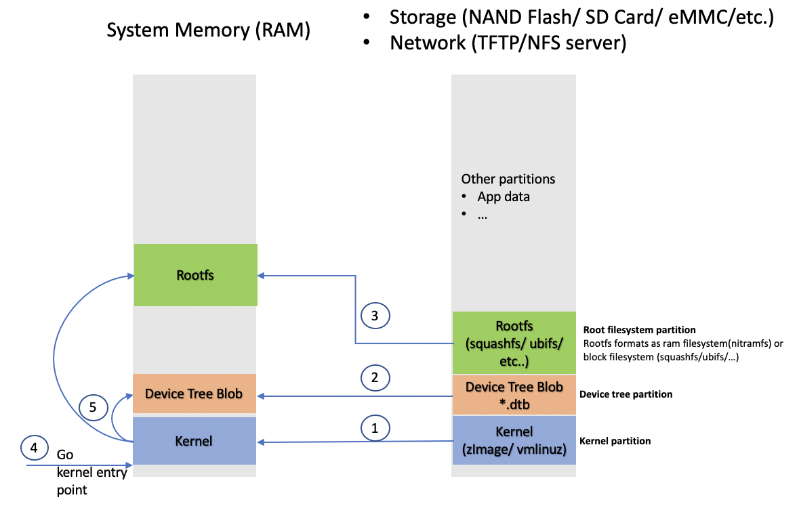

# Cross Compiling Bootloader - U-Boot for QEMU ARM emulator
We need to complete [lab1_toolchains](lab1_toolchains_crosstool-ng.md) to generate the ARM cross toolchain which uses for compling kernel in this lab.

For this lab, we will decrible steps by steps to cross compile U-BOOT for ARM Versatile Express Cortex-A9 that is supported by QEMU ARM Emulator.
* Download U-Boot v2020.10 here,https://github.com/u-boot/u-boot/releases

## Prerequisite

Host environment is required for this lab consists of
* Ubuntu 16_O4LTS_x64, for mines:
```
$ cat /proc/version
Linux version 4.15.0-136-generic (buildd@lcy01-amd64-014) (gcc version 5.4.0 20160609 (Ubuntu 5.4.0-6ubuntu1~16.04.12)) #140~16.04.1-Ubuntu SMP Wed Feb 3 18:51:03 UTC 2021
```
* $ sudo apt install qemu-user qemu-system-arm build-essential git autoconf bison flex texinfo help2man gawk libtool-bin libncurses5-dev

## Steps to cross compile U-BOOT for QEMU ARM Cortex A9
```
$ cd opensource
$ wget https://github.com/u-boot/u-boot/archive/v2020.10.tar.gz
$ tar -xfz v2020.10.tar.gz
```
Apply below patch for fixing editenv command
```
diff --git a/qemu_labs/opensource/u-boot-2020.10/board/armltd/vexpress/vexpress_common.c b/qemu_labs/opensource/u-boot-2020.10/board/armltd/vexpress/vexpress_common.c
index 70f6cd8..8fea8ff 100644
--- a/qemu_labs/opensource/u-boot-2020.10/board/armltd/vexpress/vexpress_common.c
+++ b/qemu_labs/opensource/u-boot-2020.10/board/armltd/vexpress/vexpress_common.c
@@ -55,7 +55,6 @@ int board_init(void)
 {
        gd->bd->bi_boot_params = LINUX_BOOT_PARAM_ADDR;
        gd->bd->bi_arch_number = MACH_TYPE_VEXPRESS;
-       gd->flags = 0;
 
        icache_enable();
        flash__init();
```
Steps to compile
```
$ cd u-boot-2020.10/
$ export CROSS_COMPILE=arm-linux-
$ find . -name "vexpress*"
./configs/vexpress_ca5x2_defconfig
./configs/vexpress_aemv8a_semi_defconfig
./configs/vexpress_ca9x4_defconfig
./configs/vexpress_ca15_tc2_defconfig
./configs/vexpress_aemv8a_juno_defconfig
...
$ make vexpress_ca9x4_defconfig
$ make menuconfig ### run this for customizing uboot
$ make
  OBJCOPY examples/standalone/hello_world.bin
  LDS     u-boot.lds
  LD      u-boot
  OBJCOPY u-boot.srec
  OBJCOPY u-boot-nodtb.bin
  COPY    u-boot.bin
  SYM     u-boot.sym
===================== WARNING ======================
This board does not use CONFIG_DM. CONFIG_DM will be
```
## Testing U-BOOT with ARM QEMU
```
$ qemu-system-arm -M vexpress-a9 -m 512M -nographic -kernel u-boot
```
* -M: emulated machine
* -m: amount of memory in the emulated machine
* -kernel: allows to load the binary directly in the emulated machine and run the machine with it. This way, you don’t need a first stage bootloader. Of course, you don’t have this with real hardware. Press a key before the end of the timeout, to access the U-Boot prompt. You can then type the help command, and explore the few commands available.
Note: to exit QEMU, type [Ctrl][a] followed by [h] to see available commands. One of them is [Ctrl][a] followed by [x], which allows to exit the emulator.

```
$ qemu-system-arm -M vexpress-a9 -m 512M -nographic -kernel u-boot-2020.04/u-boot

U-Boot 2020.10 (Mar 04 2021 - 17:14:12 +0700)

DRAM:  512 MiB
WARNING: Caches not enabled
Flash: 128 MiB
MMC:   MMC: 0
*** Warning - bad CRC, using default environment

In:    serial
Out:   serial
Err:   serial
Net:   smc911x-0
Hit any key to stop autoboot:  0 
```
## Verify the booting sequence with ARM QEMU (U-BOOT load Kernel & Rootfs into ARM QEMU )
Example the booting sequence - how U-BOOT load Kernel/Rootfs as figure below:

	- U-BOOT loads DTB, Kernel and capably Rootfs binary from storage or network to RAM and jump to Kernel entry point.
	- Kernel launchs and tries to load the RAMDISK into RAM
	- Kernel loads device drivers (parses device tree blob & update it) and config files from RAMDISK
	- Kernel unmount RAMDISK and mounts root filesystem (mounting rootfs from nfs or storage or RAM directly)
	- Finally, Kernel starts the initialization stage

Because we have no storage with QEMU, therfore I will describe steps by steps how U-BOOT load kernel and rootfs from network
 - The Kernel & rootfs got from [lab2_kernel](lab2_kernel.md)
 - U-BOOT loads Kernel & DTB from TFTP.
 - Kernel is trying to mount rootfs from NFS.
### Setup tfpt server
```
$ sudo apt install tftpd-hpa
$ sudo systemctl status tftpd-hpa
● tftpd-hpa.service - LSB: HPA's tftp server
   Loaded: loaded (/etc/init.d/tftpd-hpa; bad; vendor preset: enabled)
   Active: active (running) since T2 2021-03-08 12:42:09 +07; 10s ago
     Docs: man:systemd-sysv-generator(8)
   CGroup: /system.slice/tftpd-hpa.service
           └─21611 /usr/sbin/in.tftpd --listen --user tftp --address :69 --secure /var/lib/tftpboot

Th03 08 12:42:09 bbtechlab systemd[1]: Starting LSB: HPA's tftp server...
Th03 08 12:42:09 bbtechlab tftpd-hpa[21598]:  * Starting HPA's tftpd in.tftpd
Th03 08 12:42:09 bbtechlab tftpd-hpa[21598]:    ...done.
Th03 08 12:42:09 bbtechlab systemd[1]: Started LSB: HPA's tftp server.

$ sudo vi /etc/default/tftpd-hpa
  1 # /etc/default/tftpd-hpa
  2 
  3 TFTP_USERNAME="tftp"
  4 TFTP_DIRECTORY="/home/bamboo/workspace/tftpboot"        ---> Change this path for yours                                                             
  5 TFTP_ADDRESS=":69"
  6 TFTP_OPTIONS="--secure --create"

$ sudo chown tftp:tftp /home/bamboo/workspace/tftpboot/
$ sudo systemctl restart tftpd-hpa
$ sudo systemctl status tftpd-hpa
● tftpd-hpa.service - LSB: HPA's tftp server
   Loaded: loaded (/etc/init.d/tftpd-hpa; bad; vendor preset: enabled)
   Active: active (running) since T2 2021-03-08 12:47:23 +07; 7s ago
     Docs: man:systemd-sysv-generator(8)
  Process: 21786 ExecStop=/etc/init.d/tftpd-hpa stop (code=exited, status=0/SUCCESS)
  Process: 21797 ExecStart=/etc/init.d/tftpd-hpa start (code=exited, status=0/SUCCESS)
   CGroup: /system.slice/tftpd-hpa.service
           └─21812 /usr/sbin/in.tftpd --listen --user tftp --address :69 --secure --create /home/bamboo/workspace

Th03 08 12:47:23 bbtechlab systemd[1]: Stopped LSB: HPA's tftp server.
Th03 08 12:47:23 bbtechlab systemd[1]: Starting LSB: HPA's tftp server...
Th03 08 12:47:23 bbtechlab tftpd-hpa[21797]:  * Starting HPA's tftpd in.tftpd
Th03 08 12:47:23 bbtechlab tftpd-hpa[21797]:    ...done.
Th03 08 12:47:23 bbtechlab systemd[1]: Started LSB: HPA's tftp server.
lines 1-14/14 (END)
```
As you can see, the tftpd-hpa service is running. So, the configuration is successful. Now, we try to test tftp server
```
$ sudo apt install tftp-hpa     #install tftp client
$ cd ~/workspace
$ echo "helloworld" > test_tftp.txt
$ ip a
1: lo: <LOOPBACK,UP,LOWER_UP> mtu 65536 qdisc noqueue state UNKNOWN group default qlen 1000
    link/loopback 00:00:00:00:00:00 brd 00:00:00:00:00:00
    inet 127.0.0.1/8 scope host lo
       valid_lft forever preferred_lft forever
    inet6 ::1/128 scope host 
       valid_lft forever preferred_lft forever
2: enp0s3: <BROADCAST,MULTICAST,UP,LOWER_UP> mtu 1500 qdisc pfifo_fast state UP group default qlen 1000
    link/ether 08:00:27:2b:e3:c9 brd ff:ff:ff:ff:ff:ff
    inet 10.0.2.15/24 brd 10.0.2.255 scope global dynamic enp0s3
       valid_lft 74230sec preferred_lft 74230sec
    inet6 fe80::be1a:8dfd:8981:6518/64 scope link 
       valid_lft forever preferred_lft forever
3: enp0s8: <BROADCAST,MULTICAST,UP,LOWER_UP> mtu 1500 qdisc pfifo_fast state UP group default qlen 1000
    link/ether 08:00:27:df:5e:8c brd ff:ff:ff:ff:ff:ff
    inet 192.168.56.103/24 brd 192.168.56.255 scope global dynamic enp0s8
       valid_lft 480sec preferred_lft 480sec
    inet6 fe80::7cdf:d2c8:3166:6f1c/64 scope link 
       valid_lft forever preferred_lft forever
$ tftp 192.168.56.103
tftp> verbose
Verbose mode on.
tftp> put test_tftp.txt
tftp> quit
$ cat ~/workspace/tftpboot/test_tftp.txt 
helloworld
```
### Setup nfs-kernel-server
```
$ sudo apt-get install nfs-kernel-server
Once installed, edit the /etc/exports file as root to add the following line, assuming that the IP address of qemu emulator board will be 192.168.1.100:
$ sudo vi /etc/exports
# /etc/exports: the access control list for filesystems which may be exported
  1 # /etc/exports: the access control list for filesystems which may be exported
  2 #       to NFS clients.  See exports(5).
  3 #
  4 # Example for NFSv2 and NFSv3:
  5 # /srv/homes       hostname1(rw,sync,no_subtree_check) hostname2(ro,sync,no_subtree_check)
  6 #
  7 # Example for NFSv4:
  8 # /srv/nfs4        gss/krb5i(rw,sync,fsid=0,crossmnt,no_subtree_check)
  9 # /srv/nfs4/homes  gss/krb5i(rw,sync,no_subtree_check)
 10 #
 11 # /home/bamboo/workspace/nfsroot/qemu_arm/vexpress_a9 192.168.1.100(rw,no_root_squash,no_subtree_check)
make sure that there is no space between the IP address and the NFS options, otherwise default options will be used for this IP address, causing your root filesystem to be read-only.
$ sudo service nfs-kernel-server restart
```
Display all exported file systems from an NFS server
```
[12:36 PM]bamboo@bbtechlab~/workspace/nfsroot/qemu_arm/vexpress_a9
$ sudo showmount -e
Export list for bbtechlab:
/home/bamboo/workspace/nfsroot/qemu_arm/vexpress_a9 192.168.1.100
```
### Setup networking between QEMU and the host
QEMU supports networking by emulating some popular network cards (NICs), and establishing virtual LANs (VLAN). There are four ways how QEMU guests can be connected then: user mode, socket redirection, Tap and VDE networking.

With this lab, I tried to setup network between QEMU and host - TAP interfaces

```
$ sudo apt-get install bridge-utils iptables dnsmasq openvpn 
```
Create a qemu-ifup locates in /etc
```
$ cd /etc
$ sudo vi qemu-ifup
#!/bin/sh
# Sample /etc/qemu-ifup to have bridged networking between qemu instances and your real net
# You need "youruser ALL=(root) NOPASSWD: /etc/qemu-ifup" in /etc/sudoers
# You also need enough rights on /dev/tun

# script to bring up the tun device in QEMU in bridged mode
# first parameter is name of tap device (e.g. tap0)

#
# some constants specific to the local host - change to suit your host
#
ETH0IPADDR=192.168.1.134
MASK=255.255.255.0
GATEWAY=192.168.1.1
BROADCAST=192.168.1.255
#
# First take enp0s3  down, then bring it up with IP address 0.0.0.0 
#
/sbin/ifdown enp0s3
/sbin/ifconfig enp0s3 0.0.0.0 promisc up
#
# Bring up the tap device (name specified as first argument, by QEMU)
#
/usr/sbin/openvpn --mktun --dev $1 --user `id -un`
/sbin/ifconfig $1 0.0.0.0 promisc up
#
# create the bridge between eth0 and the tap device
#
/sbin/brctl addbr br0
/sbin/brctl addif br0 enp0s3
/sbin/brctl addif br0 $1
# 
# only a single bridge so loops are not possible, turn off spanning tree
# protocol
#
/sbin/brctl stp br0 off 
# 
# Bring up the bridge with ETH0IPADDR and add the default route 
#
/sbin/ifconfig br0 $ETH0IPADDR netmask $MASK broadcast $BROADCAST
/sbin/route add default gw $GATEWAY
#
# stop firewall - comment this out if you don't use Firestarter
#
/usr/sbin/service firestarter stop
```
Create a qemu-ifdown locates in /etc
```
$ cd /etc
$ sudo vi qemu-ifdown
#!/bin/sh 
# 
# Script to bring down and delete bridge br0 when QEMU exits 
# 
# Bring down enp0s3 and br0 
#
/sbin/ifdown enp0s3
/sbin/ifdown br0
/sbin/ifconfig br0 down 
# 
# Delete the bridge
#
/usr/sbin/brctl delbr br0 
# 
# bring up eth0 in "normal" mode 
#
/sbin/ifconfig enp0s3 -promisc
/sbin/ifup enp0s3
#
# delete the tap device
#
/usr/sbin/openvpn --rmtun --dev $1
#
# start firewall again
# 
/usr/sbin/service firestarter start
```
### Verify the booting system with ARM QEMU
Load U-BOOT
```
$ sudo /etc/qemu-ifup tap0
$ qemu-system-arm -M vexpress-a9 -m 512M -nographic -kernel vexpress/u-boot -net nic -net tap,ifname=tap0,script=no,downscript=no
```
Press any key to enter U-BOOT env and setup U-BOOT env
```
=> setenv ipaddr 192.168.0.100
=> setenv serverip 192.168.1.134
=> setenv gateway 192.168.1.1
=> ping 192.168.1.134
host 192.168.1.134 is alive
```
run bdinfo, which will allow you to find out that RAM starts at 0x60000000. Therefore, we will use the 0x61000000 address to load Kernel and 0x62000000 to load DTB
```
=> bdinfo
boot_params = 0x60002000
DRAM bank   = 0x00000000
-> start    = 0x60000000
-> size     = 0x20000000
DRAM bank   = 0x00000001
-> start    = 0x80000000
-> size     = 0x00000004
memstart    = 0x60000000
memsize     = 0x20000000
flashstart  = 0x00000000
flashsize   = 0x08000000
flashoffset = 0x00000000
baudrate    = 38400 bps
relocaddr   = 0x7ff76000
reloc off   = 0x1f776000
Build       = 32-bit
current eth = smc911x-0
ethaddr     = 52:54:00:12:34:56
IP addr     = <NULL>
fdt_blob    = 0x00000000
new_fdt     = 0x00000000
fdt_size    = 0x00000000
arch_number = 0x000008e0
TLB addr    = 0x7fff0000
irq_sp      = 0x7fe75ee0
sp start    = 0x7fe75ed0
```

## References
* https://en.wikibooks.org/wiki/QEMU/Networking#TAP/TUN_device
